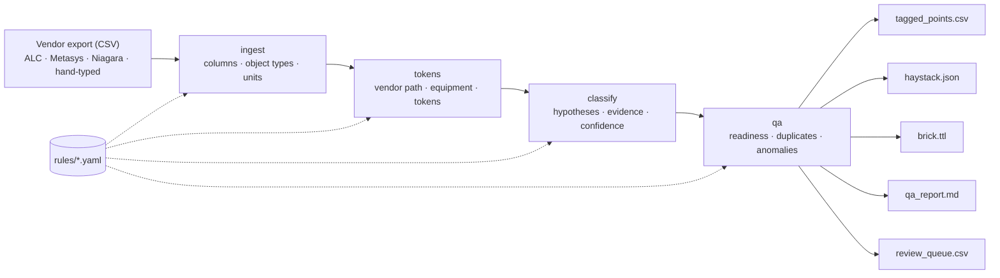

# bas-pointmap

**Turns messy, multi-vendor BAS point names into Project Haystack tags and Brick classes, scores its own confidence, and refuses to guess.**

Onboarding a building to an analytics or AI-driven HVAC platform starts with the same job every time: take a point list written by whoever programmed the controllers, figure out what each point actually is, and map it to a standard. The same discharge air temperature arrives as `#pine_paper/rtu_1/da_temp` from one site, `RTU1-DAT` from another and `Rtu #1 Disch Air Tmp` from a third. Done by hand, that work is slow. Done by naive string matching, it is dangerous: a mislabeled point feeds wrong data straight into a control decision.

`pointmap` maps what the evidence proves, shows its reasoning for every point, and sends everything else to a human review queue.

---

## In 30 seconds

| Vendor point (as exported) | Metadata | pointmap result | Status |
|---|---|---|---|
| `OFFICE-A:NAE-01/FC-1.AHU-1.SA-SP` | AI, inH₂O | `AHU-01.DA-P`, supply static pressure **sensor** | auto 1.00 |
| `OFFICE-A:NAE-01/FC-2.VMA-203.ZN-SP` | AV, °F | `VAV-203.ZN-T-SP`, zone temperature **setpoint** | auto 0.80 |
| `OFFICE-A:NAE-01/FC-1.AHU-1.SA-SP-SP` | AV, inH₂O | `AHU-01.DA-P-SP`, static pressure **setpoint** | auto 1.00 |
| `/Drivers/BacnetNetwork/RTU_4/points/HtgStg2` | BO | `RTU-04.HTG-STG2-C`, heating stage 2 command | auto 0.80 |
| `vav2-03_ZN_TEMP_DegF` | AI | `VAV-2-03.ZN-T`, unit read from the name | auto 1.00 |
| `EF-2 S/S` | BO | `EF-02.EF-C`, exhaust fan start/stop | auto 0.80 |
| `#pine_paper/rtu_1/sf_status` | **AI, amps** | **Refused.** A "status" that reads amps is a current transducer, not proof of flow. Confirm the wiring first. | review |
| `SPARE_AI_3` | AI | **Refused.** Spare I/O | review |

The first three rows are the core idea: `SP` means *setpoint* in one name and *static pressure* in another, and only the metadata can tell them apart. The seventh row is the commissioning idea: the tool doesn't just decline to map that point, it also marks RTU-01 **BLOCKED** in the readiness report, because a platform that can't prove the supply fan runs shouldn't be controlling the unit.

**Benchmark:** 243 points across four vendor styles. **0 silent errors**: all 191 auto-accepted points are correct, and 78.6% of points were mapped with no human involvement. Details in [Benchmark results](#benchmark-results).

---

## How it works (3 minutes)



**Evidence, not string matching.** Every point is judged on four independent sources: the name, the BACnet object type, the engineering units and the description. A name that fully defines a point and is confirmed by its object type and units scores 1.00. A name that needed the metadata to fill a gap starts lower. Metadata that contradicts the name costs heavily: units that disagree with the quantity are the strongest warning sign in a point list.

**Three outcomes, never a silent guess.**

| Status | Confidence | Meaning | Goes into the Haystack / Brick model? |
|---|---|---|---|
| `auto` | ≥ 0.80 | Evidence agrees. Safe to load. | Yes |
| `flagged` | 0.50 to 0.79 | Accepted, but a person should spot-check it. | Yes, marked for review in the CSV |
| `review` | < 0.50, or unattachable | Not trusted. A person decides. | **No** |

Points the tool refuses outright go to `review_queue.csv` with a plain-language reason: spare and test points, PID tuning gains, alarms, points that can't be attached to any equipment, and points whose metadata contradicts their name.

**Deployment readiness, not just tagging.** Each equipment type has a template of points an optimisation platform needs (`rules/equipment_templates.yaml`). The QA report marks every unit **READY** or **BLOCKED** and lists what is missing, so the conversation with the site is "RTU-04 has no fan status point" rather than "some points didn't map".

**What you get per site**

| File | For |
|---|---|
| `qa_report.md` | The controls lead: readiness per unit, anomalies, review queue summary. Read this first. |
| `review_queue.csv` | The person resolving exceptions: best guess, confidence, reason. |
| `tagged_points.csv` | Everyone: every point with canonical name, tags, class, confidence, flags and the full evidence trail. |
| `haystack.json` | Loading into a Haystack-based platform (site → equip → point, Hayson grid). |
| `brick.ttl` | Loading into a Brick / RDF-based platform. |

Operating procedure for a real onboarding: [docs/RUNBOOK.md](docs/RUNBOOK.md).

---

## Engineering detail

### Quick start

```bash
git clone https://github.com/MukeshChadaram/BAS-Pointmap.git && cd BAS-Pointmap
python -m venv .venv && source .venv/bin/activate
pip install -e ".[dev]"

pointmap map data/raw/office_a_metasys.csv --site OFFICE-A --out output/office_a
pointmap evaluate output/office_a/tagged_points.csv data/ground_truth/office_a_metasys.csv

pytest                         # 42 tests, including the benchmark as a regression suite
python scripts/benchmark.py    # all four sites -> examples/output/ and BENCHMARK.md
```

Python 3.11+. Runtime dependencies: pandas, PyYAML. Development: pytest, rdflib (used by the tests to prove `brick.ttl` parses). No machine learning, no network calls, no external services.

### Repository layout

```
pointmap/
  ingest.py       stage 1  read CSV; normalize headers, object types, units, encodings
  tokens.py       stage 2  split vendor paths; find equipment; tokenize the point name
  classify.py     stage 3  hypotheses → candidate roles → evidence-weighted score
  qa.py           stage 4  readiness per equipment, duplicates, anomalies
  export/         stage 5  tables.py · haystack.py · brick.py · report.py
  pipeline.py     wires the stages together
  evaluate.py     scores runs against the answer keys (totals + per site)
  cli.py          `pointmap map` and `pointmap evaluate`
rules/
  abbreviations.yaml         token dictionary, ambiguous tokens, units, BACnet types
  point_roles.yaml           the mapping standard: 33 roles with Haystack tags and Brick classes
  equipment_templates.yaml   9 equipment types, aliases, required/recommended points
data/raw/                    mock vendor exports, 4 sites (see data/README.md)
data/ground_truth/           answer keys, written by hand and frozen before the first run
examples/output/             committed outputs per site + BENCHMARK.md: reviewable without running anything
scripts/benchmark.py         regenerates examples/output; --check mode fails CI on stale output or silent errors
docs/RUNBOOK.md              operating procedure
tests/                       unit tests, trap regressions, answer-key integrity, benchmark thresholds
```

### Walking one point through the pipeline

`OFFICE-A:NAE-01/FC-2.VMA-203.ZN-SP`, object type AV, units `deg F`:

1. **ingest** normalizes `deg F` to `°F` (family: temp) and confirms `AV` is a known object type.
2. **tokens** splits the Metasys reference on `:` `/` `.`, searches segments right-to-left for equipment and finds `VMA-203`, a Metasys VAV alias, giving `VAV-203`. The point tokens are `ZN`, `SP`.
3. **classify** reads `ZN` as position=zone. `SP` is declared ambiguous, so two hypotheses are tested: *setpoint* and *static pressure*. Under *setpoint*, role `ZN-T-SP` needs a quantity the name doesn't give; the units supply temp, so the name "needed metadata" and starts at 0.45. Under *static pressure*, no role describes a zone pressure sensor, so that hypothesis produces nothing.
4. **Score:** 0.45 base, −0.05 for the ambiguous token, +0.20 AV agrees, +0.20 °F agrees = **0.80 → auto**.

The `evidence` column records exactly that, in that order:

```
equipment: 'VMA-203' -> vav VAV-203 | tokens: ZN=position=zone · SP=?(function=sp or quantity=pressure)
| quantity=temp inferred from units °F | score: name needed metadata to be complete +0.45,
ambiguous token resolved (SP→function=sp) -0.05, object type AV agrees +0.20, units °F agree +0.20 = 0.80
```

### Design decisions

**Rules in YAML, logic in Python.** All BAS domain knowledge (abbreviations, point roles, equipment templates) lives in three YAML files. Teaching the tool a new vendor convention is a one-line rule change reviewed like code, not a code change. Rule files are validated at load time: an unknown dimension, a template entry that matches no role, or a duplicate alias fails before any point is processed.

**Deterministic rules instead of a model.** Point mapping feeds control decisions, so every result must be explainable to the engineer who signs off the site and reproducible on re-run. The same input and rules produce byte-identical output (no timestamps, stable ordering), so a rules change shows up in `git diff` as exactly the points it affected.

**Ambiguity is resolved by evidence, not by default.** `SP`, `SPT`, `OUT` and `RUN` fork into competing hypotheses, and the object type and units pick the winner. If a *different* role scores within 0.10 of the winner, the point is marked ambiguous and penalised instead of picked. When one token appears twice (`SA-SP-SP`), readings where an ambiguous token adds nothing new are discarded, so the two `SP`s resolve to one static pressure and one setpoint.

**Conventions versus inference.** Some gaps are filled by how people write names: a measured quantity with no SP/CMD word is a sensor; a heating stage with no function word is its command. Those keep full confidence. Gaps filled from metadata (function from the object type, quantity from the units) lower the base score, because the name alone didn't carry the meaning.

**Equipment context, never invention.** A bare `fan` on an RTU is the supply fan, and `S/S` on an exhaust fan starts that fan. Context only fills gaps; it never overwrites what the name says. Equipment ids are normalized but not invented: `VMA-203` becomes `VAV-203`, not `VAV-2-03`, because nothing in the name says which floor it is on.

**Refuse rather than orphan.** A point that can't be attached to equipment goes to review even if its role is certain, because it can't be modelled or controlled. Only roles declared `site_level` (outside air temperature and humidity) may live on the site itself.

**Auto-accept means every word was understood.** A name containing a word the rules don't know, or a typo recovered by fuzzy matching (stdlib `difflib`, similarity ≥ 0.82, tokens of 4+ characters), can be mapped but is capped at *flagged*. `RTU1 DAT HI LIMIT` reads like a discharge air temperature; the words `HI LIMIT` are exactly why a person should look before it is loaded.

### Scoring model

Scores are the sum of the terms below, clipped to 0–1. The weights live together at the top of `classify.py`.

| Term | Weight |
|---|---:|
| Name defines the role (with conventions and equipment context) | +0.60 |
| Name needed metadata to be complete (instead of the above) | +0.45 |
| Ambiguous token resolved by evidence | −0.05 |
| Object type agrees / contradicts | +0.20 / −0.25 |
| Units agree / contradict | +0.20 / −0.30 |
| Description agrees / contradicts | +0.05 / −0.10 |
| Name carries a meaning the role doesn't use (each) | −0.10 |
| Unknown token (each, capped at −0.30) | −0.10 |
| Token recovered by fuzzy match (each) | −0.10 |
| Role unusual on this equipment type | −0.15 |
| No equipment found (non-site-level roles) | −0.20 |
| A different role scored within 0.10 | −0.15 |

Two hard limits sit on top of the score: auto-accept requires every word of the name to be understood, and a point that can't be attached to equipment always goes to review. The weights are engineering judgement, not fitted parameters. The benchmark exists to show whether they hold up.

### Extending the rules

A new vendor abbreviation goes in `rules/abbreviations.yaml`:

```yaml
tokens:
  DCHG: {position: discharge}
```

A new kind of point goes in `rules/point_roles.yaml`, with its requirements, the metadata that agrees with it, and its Haystack tags and Brick class. A new equipment type, or a change to what "ready" means for one, goes in `rules/equipment_templates.yaml`. Re-run the benchmark after any rule change: a rule that fixes one site and breaks another shows up immediately in the evaluation.

### Benchmark results

<!-- From examples/output/BENCHMARK.md, generated by `python scripts/benchmark.py`. -->

| Metric | Result |
|---|---:|
| Points evaluated | 243 |
| Auto-accepted precision | 100.0% (191/191) |
| Accepted precision (auto + flagged) | 97.7% (209/214) |
| Coverage (auto-accepted share) | 78.6% (191/243) |
| Review-queue rate | 11.9% (29/243) |
| Correct refusals | 94.1% (16/17) |
| Silent errors (auto-accepted and wrong) | 0 |

| Site | Points | Auto precision | Silent errors | Coverage | Review rate | Correct refusals |
|---|---:|---:|---:|---:|---:|---:|
| PINE-PAPER | 61 | 100.0% | 0 | 88.5% | 8.2% | 4/4 |
| OFFICE-A | 70 | 100.0% | 0 | 82.9% | 11.4% | 3/3 |
| STORE-01 | 56 | 100.0% | 0 | 80.4% | 7.1% | 2/2 |
| LEGACY-MIX | 56 | 100.0% | 0 | 60.7% | 21.4% | 7/8 |

**What the numbers mean.** Every point the tool auto-accepted was right. The five accepted mistakes all landed in the *flagged* tier, where a person spot-checks them: four Niagara `EconDmprPos` points mapped as generic damper commands instead of the outside air damper, and one high-limit parameter read as a sensor. The 13 mappable points sent to review are safe misses. Most are conventions the dictionary doesn't know yet (Metasys `HTG-O` reheat outputs, `EffClgSp`, `AHU1 DUCT STATIC`, a concatenated `Spacetemp`), each a one-line rule away from being mapped. The rest are points whose metadata can't resolve the name, such as a zone `SP` exported without units, where declining to guess is the intended behaviour. With 191 auto-accepts and no errors, the rule-of-three bound puts the true silent-error rate on similar data below about 1.6% at 95% confidence. That is a real bound, but a loose one, which is the honest reading of a 243-point benchmark.

**How they were produced.** The benchmark consists of four synthetic sites with deliberate traps, described in [data/README.md](data/README.md). Every point has an answer written by hand from the design of its row, including the points the tool **should** refuse. The keys record what each point *is*, never which confidence tier the tool should assign, and were frozen (checksummed) before the first run. That first run, on the engine as originally written, found two defects:

1. **A path-parsing bug.** The `S/S` → `SS` rewrite matched across path separators, so `points/SpaceTemp` gained a phantom status token and STORE-01 coverage was 51.8%.
2. **A near-miss silent error.** `RTU1 DAT HI LIMIT` scored 0.80 as a discharge air temperature sensor and escaped auto-acceptance only because it collided with another DA-T on the same unit.

Both were fixed in the engine as general rules, and both now have regression tests. The answer keys are unchanged, and no abbreviations or roles were added after seeing results, so the misses above are the rule set's genuine gaps.

### Standards

Tag and class names were checked against the official sources, not written from memory: Project Haystack 4 defs ([haystack-defs](https://github.com/Project-Haystack/haystack-defs), commit `d042781`) and the Brick Schema 1.3.0 release ontology. Where Brick 1.3 has no specific class, the nearest verified parent is used and noted in the rule file (zone CO₂ uses `CO2_Sensor`; unit and vestibule heaters use `Space_Heater`). The Haystack export uses one custom tag, `pointmapSource`, to carry the original vendor name for traceability.

### Limitations

These are deliberate scope limits for v0.1, listed so nobody has to discover them.

The rule set covers 33 point roles on 9 equipment types, weighted toward packaged rooftop units, AHUs, VAV boxes and small heating equipment. Anything outside it goes to review until a rule is added, which is the intended behaviour. Equipment must appear somewhere in the point name or vendor path; mapping points to equipment through a separate device list is not yet supported. Points attach to their parent equipment; sub-equipment (for example a supply fan modelled as its own equipment inside an AHU) is not modelled. Units are checked for consistency but not converted. The Haystack export carries no connector, history or timezone tags. The benchmark sites are synthetic and were written by the same author as the rules: they measure the rules against known conventions and designed traps, not field accuracy on an unseen building. The first real test is a point list the rules have never seen.

### License

MIT. See [LICENSE](LICENSE).
